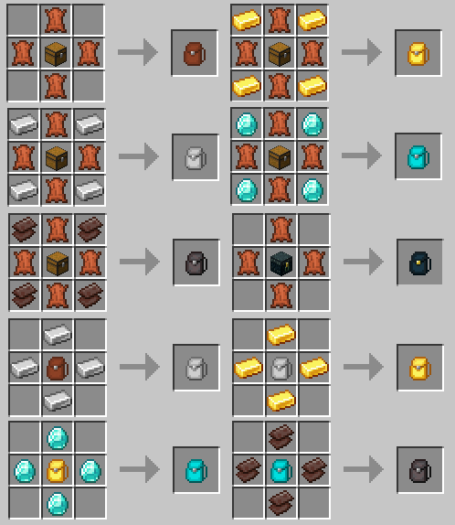

Add backpacks to Minecraft 1.16.2

This mod require Fabric Loader and Fabric API to work (https://fabricmc.net/)

### Tiers

- Leather Backpack (18 slots)
- Iron Backpack (36 slots)
- Gold Backpack (54 slots)
- Diamond Backpack (77 slots)
- Netherite Backpack (117 slots)

### Other

- Ender backpack (Ender chest inventory)

### Recipes

### Modpacks

Yes you can use this mod in your own modpack